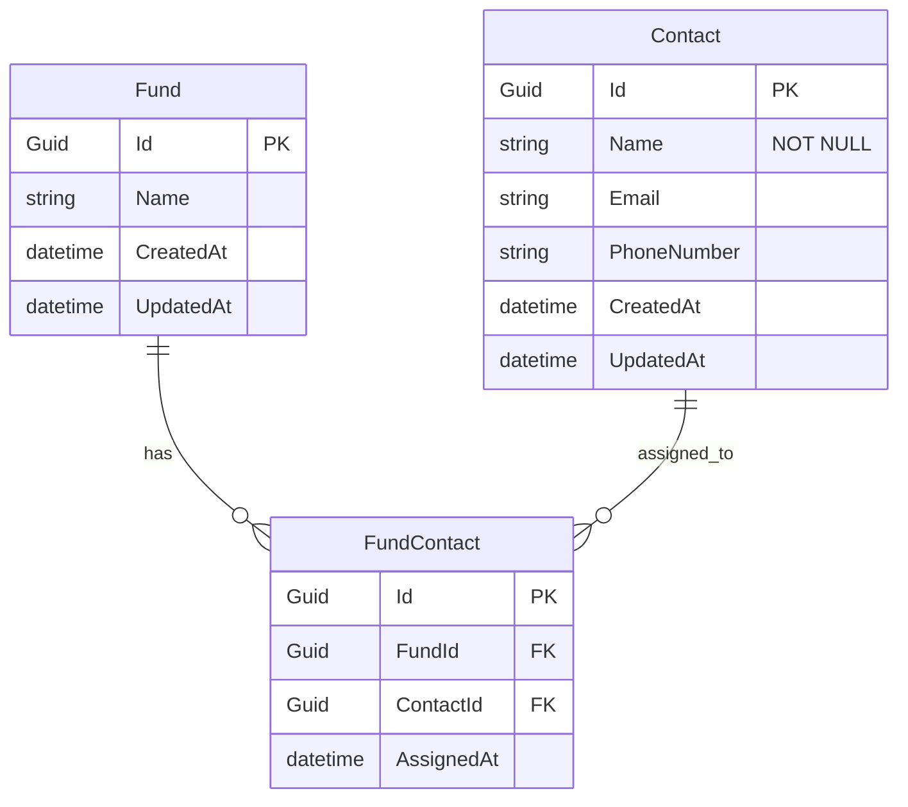

```mermaid
erDiagram
    Fund {
        Guid Id "PK"
        string Name
        datetime CreatedAt
        datetime UpdatedAt
    }
    
    Contact {
        Guid Id "PK"
        string Name "NOT NULL"
        string Email
        string PhoneNumber
        datetime CreatedAt
        datetime UpdatedAt
    }
    
    FundContact {
        Guid Id "PK"
        Guid FundId "FK"
        Guid ContactId "FK"
        datetime AssignedAt
    }
    
    Fund ||--o{ FundContact : has
    Contact ||--o{ FundContact : assigned_to

```

